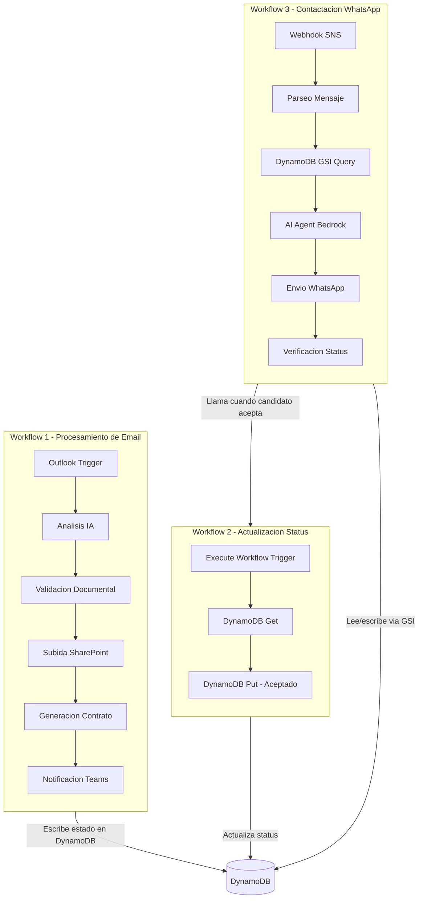
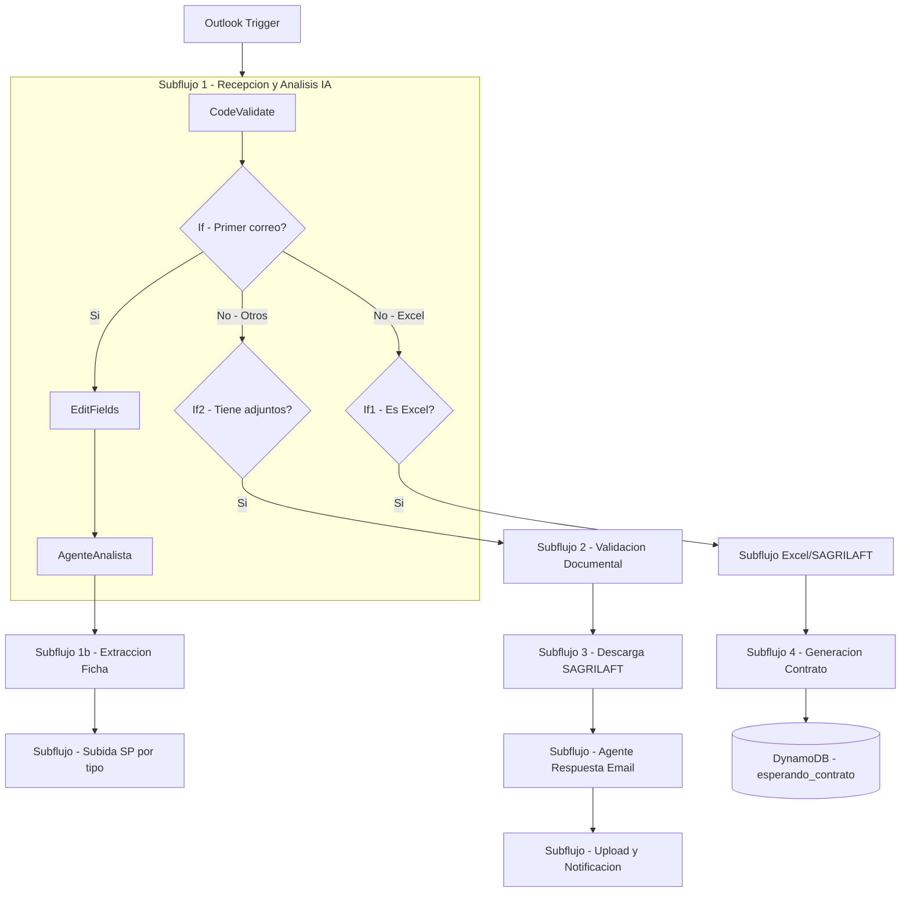
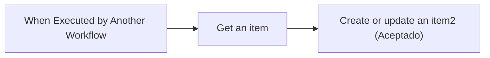
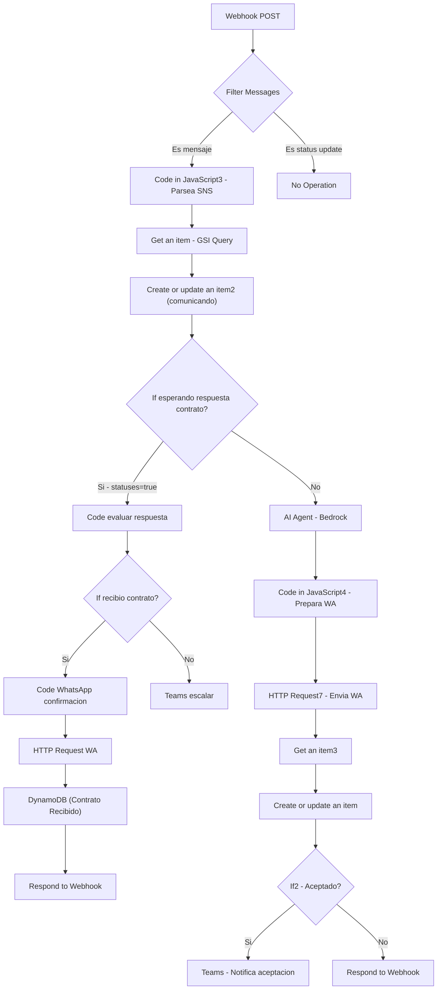

# Documentacion Tecnica de Workflows n8n - Nodo por Nodo

Documentacion operativa detallada de los 3 workflows que componen el sistema automatizado de contratacion. Cada nodo funcional esta descrito con su tipo, funcion, entradas, salidas y configuracion clave.

> Para informacion general sobre DynamoDB, GSI, servicios externos y troubleshooting, consultar [N8N_CONFIGURATION.md](./N8N_CONFIGURATION.md).

---

## Indice

1. [Vision General del Sistema](#vision-general-del-sistema)
2. [Workflow 1: Procesamiento de Email](#workflow-1-procesamiento-de-email)
3. [Workflow 2: Actualizacion de Status](#workflow-2-actualizacion-de-status)
4. [Workflow 3: Contactacion WhatsApp](#workflow-3-contactacion-whatsapp)

---

## Vision General del Sistema

El sistema opera con 3 workflows interconectados:

### Tabla resumen

| Workflow | Trigger | Nodos funcionales | Funcion principal |
|----------|---------|-------------------|-------------------|
| Procesamiento de Email | Microsoft Outlook Trigger | ~70 | Recibir correos, analizar documentos con IA, subir a SharePoint, generar contratos |
| Actualizacion de Status | Execute Workflow Trigger | 3 | Marcar candidato como "Aceptado" en DynamoDB |
| Contactacion WhatsApp | Webhook POST (SNS) | ~20 | Chatbot WhatsApp con IA, gestion de contrato |

---

## Workflow 1: Procesamiento de Email

- **Trigger**: Microsoft Outlook (correo entrante)
- **Nodos totales**: ~98 (incluyendo sticky notes y NoOp)
- **Nodos funcionales**: ~70

### Diagrama de subflujos

---

### Subflujo 1 - Recepcion y Analisis IA

Recibe el correo, valida el tipo, y ejecuta el primer analisis con IA.

#### 1. Microsoft Outlook Trigger

- **Tipo**: `n8n-nodes-base.microsoftOutlookTrigger`
- **Funcion**: Detecta correos entrantes en la bandeja configurada
- **Salida**: `Code validate email type`
- **Config**: Polling de correos nuevos. Entrega subject, body, sender, attachments
- **Credencial**: Microsoft Outlook OAuth2

#### 2. Code validate email type

- **Tipo**: `n8n-nodes-base.code`
- **Funcion**: Analiza el correo entrante para determinar si es un primer correo con documentos, un correo con Excel/SAGRILAFT, u otro tipo
- **Entrada**: Microsoft Outlook Trigger
- **Salida**: `If`
- **Config**: Evalua subject, attachments y sender para clasificar el correo

#### 3. If (Primer correo?)

- **Tipo**: `n8n-nodes-base.if`
- **Funcion**: Bifurca el flujo segun el tipo de correo detectado
- **Entrada**: Code validate email type
- **Salida True**: `Edit Fields` (es primer correo con documentos)
- **Salida False**: `If1` (puede ser Excel/SAGRILAFT)

#### 4. Edit Fields

- **Tipo**: `n8n-nodes-base.set`
- **Funcion**: Prepara los campos necesarios para el agente analista (limpia y estructura datos del correo)
- **Entrada**: If (true)
- **Salida**: `Agente Analista mensaje bienvenida` + `Create or update an item4`
- **Nota**: Envia datos en paralelo al agente IA y al registro DynamoDB

#### 5. Create or update an item4 (DynamoDB)

- **Tipo**: `n8n-nodes-base.awsDynamoDb`
- **Funcion**: Crea el registro inicial del candidato con status `ANALIZANDO`
- **Entrada**: Edit Fields
- **Salida**: (fin de rama)
- **Config**: PutItem en `n8n_table_state_users`, PK = email del remitente, status = "ANALIZANDO", ts_documentos_recibidos = timestamp actual
- **Credencial**: AWS IAM

#### 6. Agente Analista mensaje bienvenida

- **Tipo**: `@n8n/n8n-nodes-langchain.agent`
- **Funcion**: Agente IA que analiza el contenido del correo y genera un mensaje de bienvenida con instrucciones para el candidato
- **Entrada**: Edit Fields
- **Salida**: `Get many messages` + `Create message1` (Teams)
- **Config**: AWS Bedrock con Structured Output Parser. Extrae informacion relevante del correo y genera respuesta
- **Sub-nodos**:
  - `AWS Bedrock Chat Model`: Modelo de lenguaje (Claude/Nova)
  - `Structured Output Parser`: Parsea la salida del agente en formato estructurado

#### 7. Create message1 (Teams)

- **Tipo**: `n8n-nodes-base.microsoftTeams`
- **Funcion**: Notifica al equipo de Capital Humano que se recibio un nuevo correo de candidato
- **Entrada**: Agente Analista
- **Salida**: `No Operation, do nothing2`
- **Config**: Canal "Contratacion TEAM" en equipo "Dinamica Virtual"
- **Credencial**: Microsoft Teams OAuth2

#### 8. Get many messages

- **Tipo**: `n8n-nodes-base.microsoftOutlook`
- **Funcion**: Obtiene los mensajes/adjuntos del hilo de correo para procesamiento detallado
- **Entrada**: Agente Analista
- **Salida**: `Filter`

#### 9. Filter

- **Tipo**: `n8n-nodes-base.filter`
- **Funcion**: Filtra los mensajes relevantes del hilo, descartando respuestas automaticas o mensajes del sistema
- **Entrada**: Get many messages
- **Salida**: `Code in JavaScript3`

#### 10. Code in JavaScript3

- **Tipo**: `n8n-nodes-base.code`
- **Funcion**: Prepara los datos filtrados para el agente extractor de ficha tecnica
- **Entrada**: Filter
- **Salida**: `Agente Extractor Ficha`

#### 11. Agente Extractor Ficha

- **Tipo**: `@n8n/n8n-nodes-langchain.agent`
- **Funcion**: Agente IA que extrae la ficha tecnica del candidato (nombre, cedula, puesto, edad, tipo de contrato, etc.) de los documentos adjuntos
- **Entrada**: Code in JavaScript3
- **Salida**: `If4`
- **Sub-nodos**:
  - `AWS Bedrock Chat Model2`: Modelo de lenguaje
  - `Structured Output Parser2`: Parsea datos extraidos en JSON estructurado

#### 12. If4

- **Tipo**: `n8n-nodes-base.if`
- **Funcion**: Evalua si la extraccion fue exitosa y bifurca segun resultado
- **Entrada**: Agente Extractor Ficha
- **Salida True**: `Create message3` (Teams - notifica extraccion exitosa)
- **Salida False**: `Append or update a sheet` (Excel) + `Get an item before 3` + `Code in JavaScript2`
- **Nota**: La rama false continua el proceso normal de validacion

---

### Subflujo 1b - Correo Excel/SAGRILAFT

Procesa correos que contienen archivos Excel/SAGRILAFT del candidato.

#### 13. If1 (Es Excel?)

- **Tipo**: `n8n-nodes-base.if`
- **Funcion**: Detecta si el correo contiene archivos Excel (.xlsx/.xls)
- **Entrada**: If (false)
- **Salida True**: `Code prepare Excel data`
- **Salida False**: `If2`

#### 14. Code prepare Excel data

- **Tipo**: `n8n-nodes-base.code`
- **Funcion**: Prepara los datos de los archivos Excel adjuntos para su procesamiento y carga
- **Entrada**: If1 (true)
- **Salida**: `Get an item1` (DynamoDB)

#### 15. Get an item1 (DynamoDB)

- **Tipo**: `n8n-nodes-base.awsDynamoDb`
- **Funcion**: Consulta datos del candidato por email para obtener contexto (nombre, carpeta SP, etc.)
- **Entrada**: Code prepare Excel data
- **Salida**: `SP Code build Excel path`
- **Config**: GetItem por PK = email del remitente

#### 16. SP Code build Excel path

- **Tipo**: `n8n-nodes-base.code`
- **Funcion**: Construye la ruta de SharePoint donde se subiran los archivos Excel del candidato
- **Entrada**: Get an item1
- **Salida**: `SP Upload Excel to SharePoint`
- **Config**: Genera ruta tipo `/sites/.../Expedientes/Activos/Consultores/NombreCandidato/SAGRILAFT/`

#### 17. SP Upload Excel to SharePoint

- **Tipo**: `n8n-nodes-base.httpRequest`
- **Funcion**: Sube los archivos Excel a SharePoint via REST API
- **Entrada**: SP Code build Excel path
- **Salida**: `Aggregate Excel uploads`
- **Config**: POST a `/_api/web/GetFolderByServerRelativeUrl('ruta')/Files/add(url='nombre',overwrite=true)`
- **Credencial**: Microsoft SharePoint OAuth2

#### 18. Aggregate Excel uploads

- **Tipo**: `n8n-nodes-base.aggregate`
- **Funcion**: Consolida los resultados de multiples uploads en un solo item
- **Entrada**: SP Upload Excel to SharePoint
- **Salida**: `Create chat message Excel`

#### 19. Create chat message Excel (Teams)

- **Tipo**: `n8n-nodes-base.microsoftTeams`
- **Funcion**: Notifica al equipo que se recibieron archivos Excel/SAGRILAFT del candidato
- **Entrada**: Aggregate Excel uploads
- **Salida**: `Code prepare WhatsApp Excel`
- **Config**: Incluye nombre del candidato y cedula en el mensaje

#### 20. Code prepare WhatsApp Excel

- **Tipo**: `n8n-nodes-base.code`
- **Funcion**: Prepara el payload de WhatsApp para notificar al candidato que se recibieron sus documentos
- **Entrada**: Create chat message Excel
- **Salida**: `HTTP Request WhatsApp Excel`
- **Config**: Obtiene telefono de DynamoDB (`Get DynamoDB candidato Excel`), construye payload base64 para AWS Social Messaging

#### 21. HTTP Request WhatsApp Excel

- **Tipo**: `n8n-nodes-base.httpRequest`
- **Funcion**: Envia mensaje WhatsApp al candidato confirmando recepcion de documentos
- **Entrada**: Code prepare WhatsApp Excel
- **Salida**: `SP Code build plantilla path` (continua a generacion de contrato)
- **Config**: POST a `https://social-messaging.us-east-1.amazonaws.com/v1/whatsapp/send`

---

### Subflujo 2 - Validacion Documental y SharePoint

Valida los documentos con IA, crea carpetas en SharePoint y sube los archivos clasificados.

#### 22. If2 (Tiene adjuntos?)

- **Tipo**: `n8n-nodes-base.if`
- **Funcion**: Verifica si el correo tiene adjuntos documentales (no Excel)
- **Entrada**: If1 (false)
- **Salida True**: `Split Out1`
- **Salida False**: `No Operation, do nothing`

#### 23. Split Out1

- **Tipo**: `n8n-nodes-base.splitOut`
- **Funcion**: Separa los adjuntos en items individuales para procesamiento uno por uno
- **Entrada**: If2 (true)
- **Salida**: `Code in JavaScript1`

#### 24. Code in JavaScript1

- **Tipo**: `n8n-nodes-base.code`
- **Funcion**: Prepara cada adjunto individual con metadata (nombre, extension, tamano)
- **Entrada**: Split Out1
- **Salida**: `Edit Fields1`

#### 25. Edit Fields1

- **Tipo**: `n8n-nodes-base.set`
- **Funcion**: Estructura los campos de cada documento para el agente validador
- **Entrada**: Code in JavaScript1
- **Salida**: `Aggregate`

#### 26. Aggregate

- **Tipo**: `n8n-nodes-base.aggregate`
- **Funcion**: Consolida todos los documentos procesados en un solo item para el agente validador
- **Entrada**: Edit Fields1
- **Salida**: `Get an item`

#### 27. Get an item (DynamoDB)

- **Tipo**: `n8n-nodes-base.awsDynamoDb`
- **Funcion**: Consulta el registro del candidato para obtener datos contextuales antes de la validacion
- **Entrada**: Aggregate
- **Salida**: `Agente Validador Documental`
- **Config**: GetItem por PK = email del remitente

#### 28. Agente Validador Documental

- **Tipo**: `@n8n/n8n-nodes-langchain.agent`
- **Funcion**: Agente IA que clasifica cada documento recibido (cedula, RUT, certificado, etc.) y determina en que carpeta de SharePoint debe guardarse
- **Entrada**: Get an item
- **Salida**: `Create or update an item`
- **Sub-nodos**:
  - `AWS Bedrock Chat Model1`: Modelo de lenguaje
  - `Structured Output Parser1`: Parsea clasificacion de documentos

#### 29. Create or update an item (DynamoDB)

- **Tipo**: `n8n-nodes-base.awsDynamoDb`
- **Funcion**: Actualiza el registro del candidato con los resultados de la validacion documental
- **Entrada**: Agente Validador Documental
- **Salida**: `Code in JavaScript5`
- **Config**: PutItem con todos los campos, actualiza status y documentos encontrados

#### 30. Code in JavaScript5

- **Tipo**: `n8n-nodes-base.code`
- **Funcion**: Construye la URL para crear la carpeta del candidato en SharePoint
- **Entrada**: Create or update an item
- **Salida**: `HTTP Request10`

#### 31. HTTP Request10 (SP crear carpeta)

- **Tipo**: `n8n-nodes-base.httpRequest`
- **Funcion**: Crea la carpeta principal del candidato en SharePoint
- **Entrada**: Code in JavaScript5
- **Salida**: `Create channel` (Teams)
- **Config**: POST a `/_api/web/folders` con ServerRelativeUrl

#### 32. Create channel (Teams)

- **Tipo**: `n8n-nodes-base.microsoftTeams`
- **Funcion**: Notifica al equipo que se ha creado la carpeta del candidato y se estan procesando documentos
- **Entrada**: HTTP Request10
- **Salida**: `SP Get Sagrilaft files`

---

### Subflujo 3 - Descarga y Reenvio SAGRILAFT

Descarga archivos SAGRILAFT desde SharePoint para adjuntarlos al email de respuesta.

#### 33. SP Get Sagrilaft files

- **Tipo**: `n8n-nodes-base.httpRequest`
- **Funcion**: Lista los archivos disponibles en la carpeta SAGRILAFT de SharePoint
- **Entrada**: Create channel
- **Salida**: `SP Code filter Excel`
- **Config**: GET a `/_api/web/GetFolderByServerRelativeUrl('ruta')/Files`

#### 34. SP Code filter Excel

- **Tipo**: `n8n-nodes-base.code`
- **Funcion**: Filtra la lista para obtener solo archivos .xlsx/.xls, descartando otros formatos
- **Entrada**: SP Get Sagrilaft files
- **Salida**: `SP Download Sagrilaft file`

#### 35. SP Download Sagrilaft file

- **Tipo**: `n8n-nodes-base.httpRequest`
- **Funcion**: Descarga cada archivo Excel como binario desde SharePoint
- **Entrada**: SP Code filter Excel
- **Salida**: `SP Fix Sagrilaft filename`
- **Config**: GET a `/_api/web/GetFileByServerRelativeUrl('ruta')/$value`
- **Nota**: El archivo se descarga con nombre `$value` por defecto

#### 36. SP Fix Sagrilaft filename

- **Tipo**: `n8n-nodes-base.code`
- **Funcion**: Renombra el binario descargado con el nombre correcto y MIME type adecuado
- **Entrada**: SP Download Sagrilaft file
- **Salida**: `Aggregate2`
- **Config**: Asigna `fileName`, `fileExtension = 'xlsx'`, `mimeType = 'application/vnd.openxmlformats-officedocument.spreadsheetml.sheet'`

#### 37. Aggregate2

- **Tipo**: `n8n-nodes-base.aggregate`
- **Funcion**: Consolida todos los archivos descargados en un solo item para adjuntarlos al email
- **Entrada**: SP Fix Sagrilaft filename
- **Salida**: `Reply to a message`

#### 38. Reply to a message (Outlook)

- **Tipo**: `n8n-nodes-base.microsoftOutlook`
- **Funcion**: Responde al correo original del candidato adjuntando los formularios SAGRILAFT
- **Entrada**: Aggregate2
- **Salida**: `AI Agent2`
- **Credencial**: Microsoft Outlook OAuth2

#### 39. AI Agent2

- **Tipo**: `@n8n/n8n-nodes-langchain.agent`
- **Funcion**: Agente IA que genera el contenido de la respuesta al email del candidato con instrucciones sobre los documentos
- **Entrada**: Reply to a message
- **Salida**: `Get many items1`
- **Sub-nodo**: `AWS Bedrock Chat Model4`

#### 40. Get many items1 (DynamoDB)

- **Tipo**: `n8n-nodes-base.awsDynamoDb`
- **Funcion**: Obtiene datos actualizados del candidato para el email de respuesta
- **Entrada**: AI Agent2
- **Salida**: `Code in JavaScript7`

#### 41. Code in JavaScript7

- **Tipo**: `n8n-nodes-base.code`
- **Funcion**: Construye las URLs de SharePoint para subir cada documento clasificado
- **Entrada**: Get many items1
- **Salida**: `HTTP Request`

#### 42. HTTP Request (SP subir documentos)

- **Tipo**: `n8n-nodes-base.httpRequest`
- **Funcion**: Sube los documentos clasificados a las carpetas correspondientes en SharePoint
- **Entrada**: Code in JavaScript7
- **Salida**: `Create or update an item2`

#### 43. Create or update an item2 (DynamoDB)

- **Tipo**: `n8n-nodes-base.awsDynamoDb`
- **Funcion**: Actualiza el registro del candidato con el resultado final de la carga documental
- **Entrada**: HTTP Request
- **Salida**: (fin del subflujo - No Operation, do nothing3)

---

### Subflujo - Subida SP por tipo de documento

Clasifica y sube cada documento a la subcarpeta correspondiente en SharePoint.

#### 44. Get an item before 3 (DynamoDB)

- **Tipo**: `n8n-nodes-base.awsDynamoDb`
- **Funcion**: Consulta datos del candidato antes de la subida de documentos
- **Entrada**: If4 (false)
- **Salida**: `Create or update an item3`
- **Config**: GetItem por email del remitente de Outlook

#### 45. Create or update an item3 (DynamoDB)

- **Tipo**: `n8n-nodes-base.awsDynamoDb`
- **Funcion**: Actualiza timestamps y estado post-validacion (ts_documentos_recibidos, ts_analisis_ia_completado)
- **Entrada**: Get an item before 3
- **Salida**: `HTTP Request1`

#### 46. HTTP Request1 (SP crear subcarpeta)

- **Tipo**: `n8n-nodes-base.httpRequest`
- **Funcion**: Crea subcarpetas del candidato en SharePoint (Afiliaciones, Anexos, Contrato, Lista de Chequeo)
- **Entrada**: Create or update an item3
- **Salida**: `Code in JavaScript8`

#### 47. Code in JavaScript8

- **Tipo**: `n8n-nodes-base.code`
- **Funcion**: Prepara la URL y datos para subir el primer grupo de documentos clasificados
- **Entrada**: HTTP Request1
- **Salida**: `HTTP Request2`

#### 48. HTTP Request2 (SP subir archivos)

- **Tipo**: `n8n-nodes-base.httpRequest`
- **Funcion**: Sube documentos clasificados al primer grupo de carpetas
- **Entrada**: Code in JavaScript8
- **Salida**: `Code in JavaScript9`

#### 49. Code in JavaScript9

- **Tipo**: `n8n-nodes-base.code`
- **Funcion**: Prepara la URL y datos para el siguiente grupo de documentos
- **Entrada**: HTTP Request2
- **Salida**: `HTTP Request3`

#### 50. HTTP Request3 (SP subir archivos)

- **Tipo**: `n8n-nodes-base.httpRequest`
- **Funcion**: Sube documentos clasificados al segundo grupo de carpetas
- **Entrada**: Code in JavaScript9
- **Salida**: `Aggregate3`

#### 51. Aggregate3

- **Tipo**: `n8n-nodes-base.aggregate`
- **Funcion**: Consolida los resultados de todas las subidas de documentos
- **Entrada**: HTTP Request3
- **Salida**: `Create message4`

#### 52. Create message4 (Teams)

- **Tipo**: `n8n-nodes-base.microsoftTeams`
- **Funcion**: Notifica al equipo de Capital Humano que los documentos del candidato han sido procesados y subidos
- **Entrada**: Aggregate3
- **Salida**: (fin - No Operation, do nothing3)

#### 53. Code in JavaScript2

- **Tipo**: `n8n-nodes-base.code`
- **Funcion**: Prepara datos para la creacion de carpetas en SharePoint (ruta base del candidato)
- **Entrada**: If4 (false, en paralelo con Get an item before 3)
- **Salida**: `HTTP Request8`

#### 54. HTTP Request8 (SP crear carpeta candidato)

- **Tipo**: `n8n-nodes-base.httpRequest`
- **Funcion**: Crea la carpeta principal del candidato en SharePoint
- **Entrada**: Code in JavaScript2
- **Salida**: `Get an item6`

#### 55. Get an item6 (DynamoDB)

- **Tipo**: `n8n-nodes-base.awsDynamoDb`
- **Funcion**: Re-consulta datos del candidato tras la creacion de carpetas
- **Entrada**: HTTP Request8
- **Salida**: `Create or update an item1`

#### 56. Create or update an item1 (DynamoDB)

- **Tipo**: `n8n-nodes-base.awsDynamoDb`
- **Funcion**: Actualiza status del candidato tras creacion de carpetas (status: "validado")
- **Entrada**: Get an item6
- **Salida**: `Wait1`

#### 57. Wait1

- **Tipo**: `n8n-nodes-base.wait`
- **Funcion**: Pausa breve antes de verificar si el candidato necesita seguimiento
- **Entrada**: Create or update an item1
- **Salida**: `Get an item2`

#### 58. Get an item2 (DynamoDB)

- **Tipo**: `n8n-nodes-base.awsDynamoDb`
- **Funcion**: Re-consulta el estado del candidato despues de la pausa
- **Entrada**: Wait1
- **Salida**: `If3`

#### 59. If3

- **Tipo**: `n8n-nodes-base.if`
- **Funcion**: Evalua si se necesita accion adicional post-validacion
- **Entrada**: Get an item2
- **Salida True**: `HTTP Request4` (subflujo de llamada/S3)
- **Salida False**: `No Operation, do nothing1`

---

### Subflujo 4 - Generacion Automatica de Contrato

Descarga la plantilla de contrato, la diligencia con datos del candidato, y la sube a SharePoint.

#### 60. SP Code build plantilla path

- **Tipo**: `n8n-nodes-base.code`
- **Funcion**: Construye la ruta de SharePoint a la plantilla de contrato segun el tipo de contrato del candidato
- **Entrada**: HTTP Request WhatsApp Excel
- **Salida**: `SP Download plantilla contrato`
- **Config**: Ruta base: `Documentos CH/Formatos de Contratos-Politicas-Convenios/Automatizacion Contratacion/`

#### 61. SP Download plantilla contrato

- **Tipo**: `n8n-nodes-base.httpRequest`
- **Funcion**: Descarga la plantilla de contrato .docx desde SharePoint
- **Entrada**: SP Code build plantilla path
- **Salida**: `Code in JavaScript` (rename)
- **Config**: GET a `/_api/web/GetFileByServerRelativeUrl('ruta')/$value`
- **Nota**: El archivo se descarga como `$value.bin` por defecto

#### 62. Code in JavaScript (rename .bin a .docx)

- **Tipo**: `n8n-nodes-base.code`
- **Funcion**: Renombra el archivo descargado de `.bin` a `.docx` y asigna el MIME type correcto
- **Entrada**: SP Download plantilla contrato
- **Salida**: `Docxtemplater`
- **Config**: `fileName = 'Plantilla Contrato.docx'`, `mimeType = 'application/vnd.openxmlformats-officedocument.wordprocessingml.document'`

#### 63. Docxtemplater

- **Tipo**: `n8n-nodes-docxtemplater.docxTemplater` (community node)
- **Funcion**: Llena la plantilla de contrato con los datos del candidato usando placeholders
- **Entrada**: Code in JavaScript (rename)
- **Salida**: `SP Upload plantilla a candidato`
- **Config**: Recibe binario .docx y datos JSON. Reemplaza placeholders: `{nombre_trabajador}`, `{cedula}`, `{cargo}`, `{salario_letras}`, `{salario_numeros}`, `{fecha_inicio}`, `{domicilio_trabajador}`
- **Sub-nodos** (herramientas AI):
  - `Date & Time`: Herramienta de fecha/hora para el agente
  - `Code Tool`: Herramienta de codigo para el agente

#### 64. SP Upload plantilla a candidato

- **Tipo**: `n8n-nodes-base.httpRequest`
- **Funcion**: Sube el contrato diligenciado a la carpeta del candidato en SharePoint
- **Entrada**: Docxtemplater
- **Salida**: `Teams diligenciar contrato`
- **Config**: POST con binary data a SharePoint REST API. Send Body = true, Body Content Type = Binary Data

#### 65. Teams diligenciar contrato

- **Tipo**: `n8n-nodes-base.microsoftTeams`
- **Funcion**: Notifica al equipo que el contrato ha sido generado, con enlace clickable al documento
- **Entrada**: SP Upload plantilla a candidato
- **Salida**: `Code prepare WhatsApp contrato enviado`
- **Config**: Content Type = HTML. Usa `<a href="{{ $json.d.LinkingUri }}">Ver contrato aqui</a>`

#### 66. Code prepare WhatsApp contrato enviado

- **Tipo**: `n8n-nodes-base.code`
- **Funcion**: Prepara el payload para notificar al candidato por WhatsApp que su contrato esta listo
- **Entrada**: Teams diligenciar contrato
- **Salida**: `HTTP Request WhatsApp contrato enviado`

#### 67. HTTP Request WhatsApp contrato enviado

- **Tipo**: `n8n-nodes-base.httpRequest`
- **Funcion**: Envia mensaje WhatsApp al candidato informando sobre el contrato
- **Entrada**: Code prepare WhatsApp contrato enviado
- **Salida**: `Create or update esperando contrato`
- **Config**: POST a AWS Social Messaging endpoint

#### 68. Create or update esperando contrato (DynamoDB)

- **Tipo**: `n8n-nodes-base.awsDynamoDb`
- **Funcion**: Actualiza el status del candidato a "esperando_contrato" y marca statuses = "true" para activar el subflujo de contrato en WF3
- **Entrada**: HTTP Request WhatsApp contrato enviado
- **Salida**: (fin del subflujo)
- **Config**: PutItem con todos los campos, status = "esperando_contrato", statuses = "true"

---

### Subflujo 5 - Filtro Tipo de Contrato

Evalua si el tipo de contrato requiere procesamiento especial.

#### 69. If5

- **Tipo**: `n8n-nodes-base.if`
- **Funcion**: Evalua si el tipo de contrato extraido es especial y requiere revision manual
- **Entrada**: (conectado desde la rama de extraccion de datos)
- **Salida True**: (vacia - no continua)
- **Salida False**: `Create message` (Teams)
- **Nota**: Si es tipo especial, detiene el flujo y notifica

#### 70. Create message (Teams - contrato especial)

- **Tipo**: `n8n-nodes-base.microsoftTeams`
- **Funcion**: Notifica al equipo que el candidato tiene un tipo de contrato especial que requiere atencion manual
- **Entrada**: If5 (false)
- **Salida**: (fin - flujo detenido)

---

### Nodos auxiliares

#### 71. Append or update a sheet (Excel 365)

- **Tipo**: `n8n-nodes-base.microsoftExcel`
- **Funcion**: Registra datos del candidato en la hoja de control de Excel 365
- **Entrada**: If4 (false)
- **Salida**: No Operation, do nothing3

#### 72. Create message3 (Teams)

- **Tipo**: `n8n-nodes-base.microsoftTeams`
- **Funcion**: Notifica al equipo sobre resultado de la extraccion de ficha
- **Entrada**: If4 (true)
- **Salida**: No Operation, do nothing3

#### 73. HTTP Request4 / Upload a file1 / Make a call

- **Tipo**: httpRequest / awsS3 / twilio
- **Funcion**: Subflujo auxiliar para llamada de seguimiento y almacenamiento S3 (usado en casos especificos)
- **Entrada**: If3 (true)
- **Nota**: Estos nodos son para funcionalidad complementaria (llamadas Twilio + backup S3)

---

## Workflow 2: Actualizacion de Status

- **Trigger**: Execute Workflow Trigger (llamado desde Workflow 3)
- **Nodos**: 3
- **Funcion**: Marca al candidato como "Aceptado" en DynamoDB cuando confirma por WhatsApp

### Diagrama

---

### Nodos

#### 1. When Executed by Another Workflow

- **Tipo**: `n8n-nodes-base.executeWorkflowTrigger`
- **Funcion**: Recibe la invocacion desde el AI Agent del Workflow 3 cuando el candidato acepta
- **Salida**: `Get an item`
- **Config**: Parametro de entrada: `query` (String) = email del candidato (PK de DynamoDB)

#### 2. Get an item (DynamoDB)

- **Tipo**: `n8n-nodes-base.awsDynamoDb`
- **Funcion**: Consulta el registro actual del candidato para preservar todos sus campos
- **Entrada**: When Executed by Another Workflow
- **Salida**: `Create or update an item2`
- **Config**: GetItem, tabla `n8n_table_state_users`, key `whatsapp_number` = `{{ $json.query }}`

#### 3. Create or update an item2 (DynamoDB)

- **Tipo**: `n8n-nodes-base.awsDynamoDb`
- **Funcion**: Actualiza el status del candidato a "Aceptado", preservando los 17 campos
- **Entrada**: Get an item
- **Salida**: (fin)
- **Config**: PutItem con 17 campos. Campos preservados del GetItem anterior. Campos modificados:
  - `status` = "Aceptado" (literal)
  - `statuses` = "nada"
  - Campos con `.S` accessor: `direccion`, `fecha_inicio`, `salario_numeros`, `salario_letras`
  - Resto de campos: expresiones directas (`{{ $json.campo }}`)

---

## Workflow 3: Contactacion WhatsApp

- **Trigger**: Webhook POST (recibe mensajes de WhatsApp via AWS SNS)
- **Nodos funcionales**: ~20
- **Funcion**: Chatbot WhatsApp con IA que atiende candidatos, gestiona aceptacion y confirmacion de contrato

### Diagrama

---

### Subflujo Principal - Recepcion y AI Agent

#### 1. Webhook

- **Tipo**: `n8n-nodes-base.webhook`
- **Funcion**: Recibe mensajes de WhatsApp via AWS SNS (POST)
- **Salida**: `Filter Messages`
- **Config**: POST, path = UUID unico, responseMode = responseNode (requiere nodo Respond to Webhook)

#### 2. Filter Messages

- **Tipo**: `n8n-nodes-base.if`
- **Funcion**: Filtra status updates de WhatsApp (delivered, read) para procesar solo mensajes reales
- **Entrada**: Webhook
- **Salida True**: `Code in JavaScript3` (es un mensaje)
- **Salida False**: `No Operation, do nothing` (es status update, ignorar)
- **Config**: Condicion: body NOT contains "statuses"

#### 3. Code in JavaScript3 (Parsea SNS)

- **Tipo**: `n8n-nodes-base.code`
- **Funcion**: Parsea el payload de AWS SNS para extraer el mensaje de WhatsApp. Clasifica en: MENSAJE_USUARIO, ESTADO_WHATSAPP, NOTIFICACION_SISTEMA o ERROR_PARSEO
- **Entrada**: Filter Messages (true)
- **Salida**: `Get an item`
- **Config**: Extrae telefono (limpio), texto recibido (en mayusculas), nombre del perfil, wa_id, timestamp

#### 4. Get an item (DynamoDB GSI Query)

- **Tipo**: `n8n-nodes-base.awsDynamoDb`
- **Funcion**: Busca al candidato por numero de telefono usando el Global Secondary Index
- **Entrada**: Code in JavaScript3
- **Salida**: `Create or update an item2`
- **Config**:
  - Operacion: Get Many (Query)
  - Scan: false
  - Index Name: `whatsapp_numerico`
  - Key Condition: `whatsapp_numerico = :val`
  - Expression Attribute Values: `:val` tipo `N` = `{{ $json.telefono.replace(/\D/g, '') }}`
  - Limit: 1
  - Simple: false (retorna formato raw con .S, .N)

#### 5. Create or update an item2 (DynamoDB - comunicando)

- **Tipo**: `n8n-nodes-base.awsDynamoDb`
- **Funcion**: Marca al candidato como "En comunicacion" en DynamoDB
- **Entrada**: Get an item
- **Salida**: `If esperando respuesta contrato`
- **Config**: PutItem con 17 campos. Status = "En comunicacion" (literal). Preserva todos los campos del GSI Query usando accessors `.S` y `.N`

#### 6. If esperando respuesta contrato

- **Tipo**: `n8n-nodes-base.if`
- **Funcion**: Evalua si el candidato esta en estado de espera de contrato (statuses = "true")
- **Entrada**: Create or update an item2
- **Salida True**: `Code evaluar respuesta contrato WF3` (subflujo contrato)
- **Salida False**: `AI Agent` (subflujo principal chatbot)
- **Config**: Condicion: `statuses` equals "true"

#### 7. AI Agent (Bedrock)

- **Tipo**: `@n8n/n8n-nodes-langchain.agent`
- **Funcion**: Agente conversacional "CintIA" que atiende al candidato. Consulta datos en Excel, responde preguntas, y ejecuta WF2 cuando el candidato acepta
- **Entrada**: If esperando respuesta contrato (false)
- **Salida**: `Code in JavaScript4`
- **Config**:
  - Modelo: AWS Bedrock (Claude 3.5 Haiku)
  - Max tokens: 300, Temperature: 0.7
  - System Message: Define rol de CintIA, reglas de consulta, aceptacion, y formato de respuesta
  - Max iterations: 10
- **Herramientas del agente**:
  - `Microsoft Excel 365 Tool`: Consulta datos del candidato en hoja de control
  - `Call My workflow 2`: Ejecuta WF2 cuando el candidato acepta (pasa email como query)
  - `Date & Time`: Herramienta de fecha/hora
  - `Code Tool`: Herramienta de ejecucion de codigo

#### 8. AWS Bedrock Chat Model3

- **Tipo**: `@n8n/n8n-nodes-langchain.lmChatAwsBedrock`
- **Funcion**: Modelo de lenguaje que alimenta al AI Agent
- **Config**: Inference Profile `us.anthropic.claude-3-5-haiku-20241022-v1:0`, maxTokens: 300, temperature: 0.7

#### 9. Get rows from sheet in Microsoft Excel 365

- **Tipo**: `n8n-nodes-base.microsoftExcelTool`
- **Funcion**: Herramienta del AI Agent para consultar la hoja "ACTIVO" del libro de control de contratos
- **Config**: Workbook = "CONTROL CONTRATOS CINTE COLOMBIA CINTE BASE", Worksheet = "ACTIVO"
- **Credencial**: Microsoft Excel OAuth2

#### 10. Call 'My workflow 2'

- **Tipo**: `@n8n/n8n-nodes-langchain.toolWorkflow`
- **Funcion**: Herramienta del AI Agent que invoca el Workflow 2 para marcar al candidato como Aceptado
- **Config**: Workflow ID de My workflow 2. Input: `query` = email del candidato desde `Create or update an item2`

#### 11. Code in JavaScript4 (Prepara WhatsApp)

- **Tipo**: `n8n-nodes-base.code`
- **Funcion**: Toma la respuesta del AI Agent y construye el payload base64 para AWS Social Messaging
- **Entrada**: AI Agent
- **Salida**: `HTTP Request7`
- **Config**: Obtiene telefono de DynamoDB, construye JSON de Meta WhatsApp, codifica en base64

#### 12. HTTP Request7 (Envia WhatsApp)

- **Tipo**: `n8n-nodes-base.httpRequest`
- **Funcion**: Envia la respuesta del chatbot al candidato por WhatsApp
- **Entrada**: Code in JavaScript4
- **Salida**: `Get an item3`
- **Config**: POST a `https://social-messaging.us-east-1.amazonaws.com/v1/whatsapp/send`

#### 13. Get an item3 (DynamoDB)

- **Tipo**: `n8n-nodes-base.awsDynamoDb`
- **Funcion**: Re-consulta el estado actual del candidato despues de la interaccion con el AI Agent
- **Entrada**: HTTP Request7
- **Salida**: `Create or update an item`
- **Config**: GetItem por PK = `whatsapp_number` del candidato

#### 14. Create or update an item (DynamoDB)

- **Tipo**: `n8n-nodes-base.awsDynamoDb`
- **Funcion**: Actualiza el registro del candidato con el status actual (puede haber cambiado si el agente ejecuto WF2)
- **Entrada**: Get an item3
- **Salida**: `If2`
- **Config**: PutItem con 17 campos. Status = `{{ $json.status }}` (dinamico, preserva el valor actual)

#### 15. If2 (Aceptado?)

- **Tipo**: `n8n-nodes-base.if`
- **Funcion**: Evalua si el candidato fue marcado como "Aceptado" durante esta interaccion
- **Entrada**: Create or update an item
- **Salida True**: `Create channel1` (Teams - notifica aceptacion)
- **Salida False**: `Respond to Webhook`
- **Config**: Condicion: `status` equals "Aceptado"

#### 16. Create channel1 (Teams)

- **Tipo**: `n8n-nodes-base.microsoftTeams`
- **Funcion**: Notifica al equipo que el candidato ha aceptado el cargo
- **Entrada**: If2 (true)
- **Salida**: (fin)
- **Config**: Mensaje incluye nombre, puesto y email del candidato

#### 17. Respond to Webhook

- **Tipo**: `n8n-nodes-base.respondToWebhook`
- **Funcion**: Responde al webhook de SNS con status 200 (obligatorio para evitar reintentos)
- **Entrada**: If2 (false) / Create or update procesado WF3
- **Config**: Response code 200, respond with all incoming items

---

### Subflujo Contrato - Validacion de Respuesta

Maneja la respuesta del candidato sobre la recepcion del contrato.

#### 18. Code evaluar respuesta contrato WF3

- **Tipo**: `n8n-nodes-base.code`
- **Funcion**: Evalua la respuesta del candidato para determinar si confirmo recepcion del contrato
- **Entrada**: If esperando respuesta contrato (true)
- **Salida**: `If recibio contrato WF3`
- **Config**: Detecta patrones de SI ("si", "1", "recibi", "ya lo tengo") y NO ("no", "2", "no me llego"). Extrae nombre y whatsappNumber del candidato

#### 19. If recibio contrato WF3

- **Tipo**: `n8n-nodes-base.if`
- **Funcion**: Bifurca segun si el candidato confirmo o no la recepcion del contrato
- **Entrada**: Code evaluar respuesta contrato WF3
- **Salida True**: `Code WhatsApp confirmacion WF3`
- **Salida False**: `Teams escalar no recibio WF3`
- **Config**: Condicion: `recibioContrato` equals true

#### 20. Code WhatsApp confirmacion WF3

- **Tipo**: `n8n-nodes-base.code`
- **Funcion**: Prepara mensaje de confirmacion y bienvenida para el candidato que recibio el contrato
- **Entrada**: If recibio contrato WF3 (true)
- **Salida**: `HTTP Request WhatsApp confirmacion WF3`
- **Config**: Mensaje de bienvenida, indicaciones de firma digital y devolucion por AUCO

#### 21. HTTP Request WhatsApp confirmacion WF3

- **Tipo**: `n8n-nodes-base.httpRequest`
- **Funcion**: Envia mensaje de confirmacion y bienvenida al candidato por WhatsApp
- **Entrada**: Code WhatsApp confirmacion WF3
- **Salida**: `Create or update procesado WF3`

#### 22. Create or update procesado WF3 (DynamoDB)

- **Tipo**: `n8n-nodes-base.awsDynamoDb`
- **Funcion**: Marca al candidato con status "Contrato Recibido" y desactiva el flag de espera
- **Entrada**: HTTP Request WhatsApp confirmacion WF3
- **Salida**: `Respond to Webhook`
- **Config**: PutItem con todos los campos. Status = "Contrato Recibido", statuses = "false"

#### 23. Teams escalar no recibio WF3

- **Tipo**: `n8n-nodes-base.microsoftTeams`
- **Funcion**: Escala al equipo cuando el candidato indica que NO recibio el contrato
- **Entrada**: If recibio contrato WF3 (false)
- **Salida**: (fin)
- **Config**: Mensaje URGENTE con nombre del candidato, respuesta original, e indicaciones de verificacion

---

## Credenciales Utilizadas

| Credencial | Tipo | Workflows |
|------------|------|-----------|
| AWS (IAM) account | aws | WF1, WF2, WF3 |
| Microsoft SharePoint account | microsoftSharePointOAuth2Api | WF1 |
| Microsoft Teams account | microsoftTeamsOAuth2Api | WF1, WF3 |
| Microsoft Excel account | microsoftExcelOAuth2Api | WF1, WF3 |
| Microsoft Outlook account | microsoftOutlookOAuth2Api | WF1 |

---

*Ultima actualizacion: 2026-02-17*
